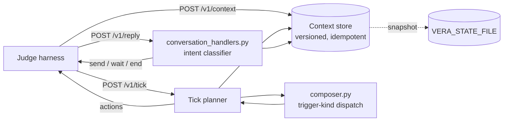

# Vera — merchant engagement bot (magicpin AI Challenge)

[](https://github.com/NirvanJha/magicpin-vera-bot/actions/workflows/ci.yml)

An HTTP bot that plays **Vera**, magicpin's WhatsApp assistant for local merchants (dentists, salons, gyms, restaurants, pharmacies) and their customers. The judge harness pushes context, wakes the bot on a clock and role-plays merchant replies. The bot decides who to message, what to say and how to carry the conversation.

**Live:** `https://magicpin-vera-bot-vtz2.onrender.com` · endpoints under `/v1/*`

---

## Design principles

1. **Every fact must come from pushed context.** Names, numbers, prices, dates and sources in a message are read from the category, merchant, trigger or customer context. If a value is missing, the sentence that needed it is dropped. There are no hardcoded fallbacks such as fake competitor names or made-up patient counts.
2. **Respect the recipient.** One message per recipient per tick. A `suppression_key` is never sent twice. The bot follows its own `wait` and `end` decisions on later ticks. An explicit STOP silences a merchant for 30 days.
3. **Act on a yes.** When a merchant commits ("ok let's do it", "haan", "go ahead"), the next message delivers the draft or checklist, not another qualifying question.
4. **Never be the reason a run fails.** The endpoints never return 500. Bodies parse with or without a JSON `Content-Type`. Ticks take milliseconds. State can survive a restart.

## Architecture



| File | Responsibility |
|---|---|
| [`bot.py`](bot.py) | FastAPI app with the 5 endpoints: the versioned context store, the tick planner (suppression, per-recipient dedup, holds, opt-outs, urgency ordering), and optional state persistence |
| [`composer.py`](composer.py) | `compose(category, merchant, trigger, customer)`: all 26 trigger kinds in the dataset (plus aliases) mapped to merchant-facing or customer-facing composers, with a category-aware voice, Hinglish when the recipient speaks Hindi, and taboo filtering |
| [`conversation_handlers.py`](conversation_handlers.py) | Classifies each reply in priority order: auto-reply → opt-out → abuse → off-topic → busy/later → decline → commitment → question. Every answer is grounded in the conversation's trigger |

### Tick planner

For each trigger the judge lists as active, the planner:
- resolves the trigger, merchant, category and customer (exact id first, then a unique prefix match);
- skips it if the merchant opted out, the customer explicitly declined messages, the `suppression_key` was already used for this recipient, or the recipient is on hold;
- orders the rest by `urgency`, sends at most one message per recipient, and stops at 20 actions.

### Reply handling

| Merchant says | Bot does |
|---|---|
| Canned WhatsApp Business auto-reply (pattern or verbatim repeat) | nudges once → waits 24h → ends |
| "Stop messaging me", "not interested", "band karo" | `end`, and the merchant is suppressed for 30 days |
| Abuse without an explicit stop | apologises once and offers a clean opt-out |
| "Can you file my GST?" | declines politely and returns to the original topic |
| "Busy, call later" / "not now" | `wait` 30 min / 24h, which later ticks honour |
| "Ok let's do it" / "haan" / "go ahead" | delivers the draft or checklist right away (action mode) |
| A question about price or time | answers from offers, slots or the digest item |

The bot never sends the same text twice in one conversation.

## Real output

These are generated by `compose()` from the challenge dataset (see [`submission.jsonl`](submission.jsonl)):

> **Competitor opened (dentist):** Dr. Meera, heads-up: Smile Studio opened 1.3 km from you on 8 Apr. They're advertising 'Dental Cleaning @ ₹199'. Your 'Dental Cleaning @ ₹299' is live — worth a fresh post so searchers see it first. Your last post is 22 days old. Main post highlighting your offer + reviews bhej doon? Reply YES.

> **Performance dip, with peer benchmark:** Dr. Bharat, your calls dropped 50% in the last 7 days (baseline 12/week). Last 30 days: 980 views, 4 calls, CTR 1.8%. Your CTR is 1.8% vs 3.0% peer average. You have no active offer — 'Dental Cleaning @ ₹299' is the most common one in your category. Main 2 ready-to-publish Google posts bhej doon? Reply YES.

> **Customer recall, sent on the merchant's behalf in Hinglish:** Hi Priya, Dr. Meera's Dental Clinic here 🦷. Aapki last visit 12 May ko thi. Aapka 6-month cleaning due hai. Aapke weekday evening preference ke hisaab se slots ready hain: Wed 5 Nov, 6pm ya Thu 6 Nov, 5pm. Dental Cleaning @ ₹299. Reply 1 for Wed 5 Nov, 2 for Thu 6 Nov.

> **Chronic refill for a senior customer:** Namaste Sharma ji, Apollo Health Plus Pharmacy here. Aapki monthly dawaiyan (metformin, atorvastatin, telmisartan) 28 Apr tak khatam ho jayengi. Same dose, same brand ready hai. Senior Citizen 15% OFF lagega. Saved address pe home delivery. Reply YES to dispatch.

## Run locally

```bash
pip install -r requirements.txt
uvicorn bot:app --port 8080
```

| Env var | Effect |
|---|---|
| `PORT` | listen port (used by `python bot.py` and the Docker image) |
| `VERA_STATE_FILE` | path for the state snapshot; when set, context, conversations and suppressions survive restarts |
| `VERA_DISABLE_SEED=1` | turn off the local-dataset fallback, so only pushed context is used |

## Tests

```bash
uvicorn bot:app --port 8080 &
python tests/e2e_judge_test.py http://127.0.0.1:8080   # 48 checks across the full judge lifecycle
python tests/restart_test.py                           # hard-kill + restart keeps judge state
python tests/test_bot.py                               # smoke test of the replay scenarios
```

`e2e_judge_test.py` follows the judge's lifecycle: warmup (the healthz counts must match the 255 base contexts), 12 five-minute ticks, adaptive injection (new digest item, updated performance numbers, a surprise customer), replay scenarios, a burst of 10 concurrent requests, and a 480 KB payload. CI runs everything on each push, both on bare Python and against the built Docker image.

`judge_simulator.py` (shipped with the challenge) also works. Without an API key it falls back to a keyword-based local scorer, which is only a rough guide. The real evaluation uses an LLM judge.

## Deploy

A single always-on instance with one worker. All state lives in the process and, if `VERA_STATE_FILE` is set, in a snapshot. Don't run multiple workers or replicas, and don't redeploy during a test window.

| Platform | How |
|---|---|
| **Fly.io** (Mumbai, persistent volume) | `fly launch --no-deploy --copy-config` → `fly volumes create vera_data --region bom --size 1` → `fly deploy` (see [`fly.toml`](fly.toml)) |
| **Railway** | New project → Deploy from GitHub repo. [`railway.json`](railway.json) selects the Dockerfile and healthcheck. Add a volume at `/data` |
| **Render** | [`render.yaml`](render.yaml) blueprint on a paid instance with a disk. Free instances sleep when idle |
| **Anything with Docker** | `docker build -t vera . && docker run -p 8080:8080 -v vera-data:/data vera` |

## Known limitations

- Messages are built from templates, with no LLM at runtime. That keeps them fast and factually safe, but the wording is less varied than a model's. The next step would be an LLM rewrite pass with a validator that rejects any number or ₹ amount not found in the contexts, falling back to the template.
- Customer consent is only checked against explicit opt-outs. The dataset's consent scopes are too coarse to filter on without dropping valid recalls.

## Repository layout

```
bot.py  composer.py  conversation_handlers.py   # the bot
tests/                                          # e2e, restart and smoke tests
dataset/  examples/  docs/                      # challenge data, API examples, briefs
generate_submission.py  submission.jsonl        # the 30 canonical test pairs
judge_simulator.py                              # challenge-provided local judge
Dockerfile  fly.toml  railway.json  render.yaml  Procfile
```
